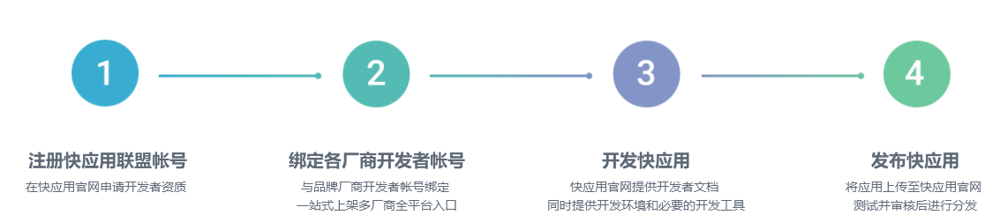

# 1. 快应用的介绍

快应用是九大手机厂商基于硬件平台共同推出的新型应用生态。用户无需下载安装，即点即用，享受原生应用的性能体验

## 1.1. 九大厂商


他们分别是 **小米、中兴、华为、金立、联想、魅族、努比亚、oppe、vivo、一加**

## 1.2. 快应用和微信小程序的对比

### 1.2.1. 用户量比较

腾讯2017年度财报显示，微信及WeChat合并月活跃用户达9.886亿

小米副总裁洪锋说道 ‘支持快应用”的手机设备很快会超过10亿台。

**结论：小程序胜出**


### 1.2.2. 支持的系统

小程序支持目前主流两大系统 android 和ios 


快应用支持绝大部分安卓手机（九大厂商的手机基本上都是基于安卓）


**结论：小程序胜出**

### 1.2.3. 应用的入口

#### 1.2.3.1. 小程序


#### 1.2.3.2. 快应用


**结论：快应用胜出**


### 1.2.4. 分析

微信之父张小龙曾说过，未来两年内，小程序将取代80%的app。而厂商的应用商店，自带浏览器和自带应用服务等都是手机厂商盈利的主要来源之一。因此

九大厂商推出的**快应用** 用意在自保甚至狙击微信小程序。目的是不希望大量的app被微信小程序替代。

​	这场战争或许是个持久战，只有更好的服务才能让消费者接受和拥护。而做为互联网的开发工程师，也绝不要错过这一波技术的潮流。

# 2. 快应用开发

快应用和小程序一样，也是面向个人开发者的。因此，可以申请注册帐号成为开发者。

## 2.1. 接入流程



## 2.2. 准备工作

1. [注册帐号](https://www.quickapp.cn/)
2. [绑定开发者帐号](https://www.quickapp.cn/myCenter/accountBind)


# 3. 技术铺垫

要想开发一个快应用，需要有前期的技术铺垫。

- node npm 常用命令，用于构建项目
- 基础的html css js 知识。
- flex布局 
- 部分 es6 

以上知识都可以通过  **传智播客 - 前端与移动开发**   网站中找到。


# 4. 快应用-军装照

## 4.1. 环境搭建

### 4.1.1. PC安装toolkit工具

#### 4.1.1.1. 安装NodeJS

需安装**6.0**以上版本的NodeJS，请从[NodeJS官网](https://nodejs.org/en/)下载

#### 4.1.1.2. 安装hap-toolkit

通过npm仓库安装，在命令行中执行以下命令：

```
npm install -g hap-toolkit
```

在命令行中执行`hap -V`会输出版本信息表示`hap-toolkit`安装成功，如下命令所示：

```javascript
hap -V
```

### 4.1.2. 手机安装调试器

主要用于在手机端调试快应用  [安装教程](https://www.quickapp.cn/docCenter/post/69)

1. 下载[快应用调试器](https://statres.quickapp.cn/quickapp/quickapp/201803/file/quickapp_debugger.apk)

   

2. 下载 [快应用预览版](https://statres.quickapp.cn/quickapp/quickapp/201803/file/quickapp_platform_preview_release.apk)

   

3. 手机端安装完毕

   


### 4.1.3. 编辑器设置

主要用于代码高亮和智能提示

**vs code **  安装插件 `Hap Extension`

## 4.2. 项目运行

### 4.2.1. 初始化项目

```
hap init <ProjectName>
```

执行成功后，会产生如下文件目录


### 4.2.2. 安装依赖

在命令行中输入 等待安装成功

```bash
npm install
```

### 4.2.3. 编译项目

将源代码编译成一个快应用程序   

```bash
npm run build 
// 或者 npm run watch 
```

如果出现报错，  `Cannot find module '.../node_modules/hap-tools/webpack.config.js'`

输入 `hap update --force`  后再重新 运行上述命令即可。

编译成功后，在项目的   `dist/com.application.demo.rpk` 位置可以看到该程序。

### 4.2.4. 手机安装快应用

电脑上运行 命令，启动服务器

```
npm run server
```

启动成功，可以看到 一个二维码


手机 扫描安装 ，要注意手机需要和电脑处在同一个局域网当中


安装成功


后期每一次修改源代码，都需要把修改 同步到手机上。可以输入  以下命令，进行监控。

```
npm run watch 
```

### 4.2.5. 小结

在第一次把项目运行起来之后，后期只需要开启 两个命令即可 

- 开启服务器  `npm run server`
- 监控修改  `npm run watch`


## 4.3. 编码

业务流程


### 4.3.1. 首页


### 4.3.2. 结果页


### 4.3.3. 后台接口

- 接口地址 `http:ip:3003/fuse`
- 请求方式 `post`
- 参数
  - 图片文件
  - 图片文件对应的name  规定为 `qaFile` 
  - model_id 模板的id 直接拼接在 接口的url上 


# 5. 快应用后台

## 5.1. 介绍

后台主要使用了使用了以下技术

- node 
- express 基于node的 框架 
- 腾讯优图的node 的 sdk
- gm 实现图片压缩 
  - [地址](https://www.npmjs.com/package/gm)
  - gm 依赖本地的 **ImageMagick** 所以本地先需要安装 [ImageMagick](http://www.imagemagick.org/)


## 5.2. 运行

获取到后台代码后

- 安装依赖 `npm install`
- 启动服务 `npm run start`

## 5.3. 修改腾讯优图密钥

因为调用腾讯接口，需要用到密钥，因此建议自行注册和替换。


## 5.4. 接口说明

后台node 提供两个接口 

一个是会压缩图片的， `/fuse` ，该接口 需要电脑系统中安装 **imageMagick**   会对图片进行统一压缩

一个是不会压缩图片的  `/fuse1`，该接口不需要电脑提前安装 **imageMagick**   ，但是上传图片如果太大，腾讯优图接口识别是失败。

# 6.1 

如果代码出现运行问题 可以请联系

yeah126139163@163.com